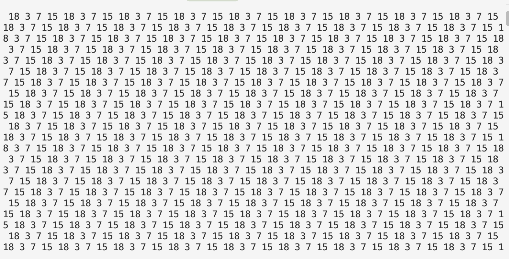

# **단방향 연결 리스트 홀수 노드 뒤로 이동(`moveOddItemsToBack`) 구현**

## **1. 문제 요구사항**

* **기능**: 연결 리스트에서 **짝수 노드를 앞에**, **홀수 노드를 뒤에** 오도록 재배치.

* **조건**:

  * 기존 노드를 그대로 사용하고 `next`를 변경하여 재배치
  * 짝수 노드들의 순서는 기존 순서 유지
  * 홀수 노드들의 순서도 기존 순서 유지

* **예시**:

  ```text
  기존 리스트

  2 → 3 → 4 → 7 → 15 → 18 → NULL


  결과

  2 → 4 → 18 → 3 → 7 → 15 → NULL
  ```

* **사용할 포인터**:

  * `start`: 기존 리스트를 순회하는 포인터
  * `evenHead`: 짝수 리스트의 시작 노드
  * `evenTail`: 짝수 리스트의 마지막 노드
  * `oddHead`: 홀수 리스트의 시작 노드
  * `oddTail`: 홀수 리스트의 마지막 노드

* **예외 조건**:

  * 짝수가 하나도 없는 경우 → `oddHead`를 새로운 `head`로 설정
  * 홀수가 하나도 없는 경우 → 기존 짝수 리스트 그대로 유지
  * 짝수와 홀수가 모두 있는 경우 → `evenTail` 뒤에 `oddHead`를 연결
  * 마지막 홀수 노드의 `next`를 `NULL`로 설정하여 기존 연결이 남지 않도록 처리

---

## **2. 시행착오 과정**

### **1차 시도: `head`와 `tail`을 구분하지 않음**

처음에는 짝수와 홀수를 각각 `oddP`, `evenP` 포인터 하나씩으로 관리했다.

```c
ListNode *start = ll->head;
ListNode *oddP = NULL;
ListNode *evenP = NULL;

while (start != NULL) {
    if (start->item % 2 == 0) {
        if (evenP == NULL) {
            evenP = start;
        } else {
            evenP->next = start;
        }
    }
    else {
        if (oddP == NULL) {
            oddP = start;
        } else {
            oddP->next = start;
        }
    }

    start = start->next;
}
```

여기서 문제는 `evenP`와 `oddP`가 **첫 번째 노드에서 더 이상 이동하지 않는다는 것**이었다.

예를 들어:

```text
2 → 3 → 4 → 7 → 15 → 18
```

에서 짝수만 따라가 보면,

처음 `2`를 만났을 때:

```c
evenP = 2;
```

그다음 `4`를 만나면:

```c
evenP->next = 4;
```

∴

```text
2 → 4
```

가 된다.

그런데 `evenP`를 `4`로 이동시키지 않았기 때문에 `18`을 만났을 때 다시

```c
evenP->next = 18;
```

이 된다.

결과적으로

```text
2 → 18
```

이 되고, 중간에 연결했던 `4`가 끊어진다.

때문에 **시작점을 가리키는 `Head`와 계속 새로운 노드를 연결할 위치를 가리키는 `Tail`을 따로 관리해야 한다.**

---

### **2차 시도: `Head`와 `Tail`을 분리**

그래서 다음과 같이 포인터를 4개로 나눴다.

```c
ListNode *oddHead = NULL;
ListNode *oddTail = NULL;
ListNode *evenHead = NULL;
ListNode *evenTail = NULL;
```

각각의 역할은 다음과 같다.

```text
evenHead → 짝수 리스트의 첫 번째 노드
evenTail → 짝수 리스트의 마지막 노드

oddHead  → 홀수 리스트의 첫 번째 노드
oddTail  → 홀수 리스트의 마지막 노드
```

처음에 각 포인터를 `NULL`로 초기화하는 이유는 **아직 해당하는 노드가 하나도 연결되지 않았다는 것을 나타내기 위해서**이다.

만약 `NULL`로 초기화하지 않고,

```c
ListNode *oddHead;
ListNode *oddTail;

ListNode *evenHead;
ListNode *evenTail;
```

처럼 선언만 한다면, 지역 변수인 포인터에는 **초기화되지 않은 쓰레기 값이 들어있을 수 있다.**

그 상태에서

```c
if (oddHead == NULL)
```

처럼 첫 번째 홀수 노드인지 확인하면, `oddHead`가 실제로 `NULL`이라는 보장이 없기 때문에 조건이 제대로 동작하지 않을 수 있다.

예를 들어 처음 `3`을 발견했을 때 원래는

```text
oddHead == NULL
        ↓
첫 번째 홀수 노드이므로
oddHead = start
oddTail = start
```

가 되어야 한다.

하지만 `oddHead`를 초기화하지 않았다면,

```text
oddHead → 쓰레기 값
```

일 수 있기 때문에

```c
if (oddHead == NULL)
```

이 거짓이 되어 `else`로 들어갈 수 있다.

그러면 아직 아무 노드도 연결하지 않았는데

```c
oddTail->next = start;
```

와 같이 **초기화되지 않은 포인터를 통해 메모리에 접근하는 문제가 발생할 수 있다.**

따라서 `NULL`로 초기화하는 것은 단순히 포인터를 비워두는 것이 아니라,

```text
oddHead  = NULL → 아직 홀수 노드 없음
oddTail  = NULL → 아직 홀수 노드 없음

evenHead = NULL → 아직 짝수 노드 없음
evenTail = NULL → 아직 짝수 노드 없음
```

처럼 **첫 번째 노드가 들어왔는지를 판단하기 위한 기준으로 사용하기 위함**이다.

### 노드를 짝수와 홀수 리스트로 분류

이렇게 각 포인터를 초기화한 후, start를 이용해 기존 리스트를 처음부터 순회하면서 각 노드를 짝수와 홀수로 나누었다.


새로운 짝수를 발견하면:

```c
if (evenHead == NULL) {
    evenHead = start;
    evenTail = start;
}
else {
    evenTail->next = start;
    evenTail = start;
}
```

첫 번째 짝수라면 `Head`와 `Tail`을 모두 현재 노드로 설정하고,

그 이후의 짝수라면 `evenTail` 뒤에 연결한 다음 `evenTail`을 현재 노드로 이동시킨다.

홀수도 같은 방식으로 처리했다.

이렇게 하면

```text
짝수

evenHead
   ↓
   2 → 4 → 18
            ↑
         evenTail


홀수

oddHead
   ↓
   3 → 7 → 15
            ↑
         oddTail
```

처럼 각각의 리스트를 따로 만들 수 있다.

---

### **짝수와 홀수 리스트를 마지막에 연결**

분류가 끝난 후에는 짝수 리스트 뒤에 홀수 리스트를 연결한다.

```c
if (oddHead != NULL) {
    evenTail->next = oddHead;
}
```

예를 들어:

```text
짝수 리스트

2 → 4 → 18 → NULL
          ↑
       evenTail


홀수 리스트

3 → 7 → 15 → NULL
↑
oddHead
```

여기서

```c
evenTail->next = oddHead;
```

를 실행하면:

```text
2 → 4 → 18 → 3 → 7 → 15
```

가 된다.

그런데 여기서 문제가 하나 생겼다.

---

### **3차 시도: 무한 반복 발생**

최종적으로 연결한 뒤 리스트를 출력했더니 특정 구간이 계속 반복됐다.

원인은 **`oddTail->next`를 `NULL`로 끊어주지 않았기 때문**이었다.

노드를 짝수/홀수로 분류할 때 기존 노드의 `next`를 완전히 초기화한 것이 아니기 때문에, 마지막 홀수 노드는 여전히 **원래 리스트에서 다음에 있던 노드**를 가리키고 있었다.


현재 리스트가 다음과 같다고 하자.

```text
2 → 3 → 4 → 7 → 15 → 18 → NULL
```

홀수 노드만 따로 연결하면 다음과 같은 상태가 된다.

```text
oddHead
  ↓
  3 → 7 → 15 → 18
      ↑
   oddTail
```

`start`가 `15`를 가리키는 상황에서 코드를 실행하면,

```c
oddTail->next = start;
oddTail = start;
```

먼저 `oddTail`은 현재 `7`을 가리키고 있으므로,

```c
oddTail->next = start;
```

를 실행하면 **`7`의 `next`가 `start`가 가리키고 있는 `15`를 가리키게 된다.**

```text
3 → 7 → 15
    ↑    ↑
 oddTail start
```

그 다음

```c
oddTail = start;
```

를 실행하면 `oddTail`도 `15`를 가리키게 된다.

```text
3 → 7 → 15 → 18
         ↑    ↑
      oddTail start
```

여기서 중요한 점은 **`oddtail`이 `start`와 같은 `15` 노드를 가리키고 있다는 것**이다.

따라서

```c
oddtail->next
```

는 

```c
start->next
```

와 같은 `15` 노드의 `next`를 의미한다.

현재 `15`의 원래 `next`는 `18`이었기 때문에,

```text
oddtail->next == &18
```

이 된다.


짝수와 홀수를 분리해서 연결한 뒤,

```text
2 → 4 → 18
3 → 7 → 15 → 18 → ...
```

마지막에

```c
evenTail->next = oddHead;
```

를 수행하면 최종적으로

```text
2 → 4 → 18 → 3 → 7 → 15 → 18 → ...
```

과 같이 연결된다.

이유는 **홀수 리스트의 마지막 노드인 `15`의 `next`를 `NULL`로 끊어주지 않았기 때문**이다.

즉, `15`의 `next`가 기존 연결을 그대로 가지고 있기 때문에, `15`에서 다시 `18`로 이동하게 된다. 그리고 `18` 이후에는 이미 앞쪽에 연결된 `3`으로 다시 이동하면서 다음과 같은 순환 구조가 만들어진다.

```text
2 → 4 → 18 → 3 → 7 → 15
              ↑         ↓
              └─────────┘
```

리스트가

```text
2 → 4 → 18 → 3 → 7 → 15 → 18 → 3 → 7 → 15 → 18 → ...
```


이렇게 **같은 노드들이 계속 반복된다.**

그래서 `while`문이 끝난 다음에 반드시

```c
if (oddTail != NULL) {
    oddTail->next = NULL;
}
```

로 **홀수 리스트의 마지막 노드가 더 이상 다른 노드를 가리키지 않도록 끊어줘야 한다.**

---

### **짝수가 없는 경우도 따로 처리**

또 하나의 문제가 있었다.

만약 리스트가

```text
1 → 3 → 5
```

처럼 홀수만 가지고 있다면 `evenHead`와 `evenTail`은 계속 `NULL`이다.

그런데 무조건

```c
evenTail->next = oddHead;
```

를 실행하면 `evenTail`이 `NULL`이기 때문에 오류가 발생한다.

따라서 짝수가 없는 경우에는 홀수 리스트의 시작점인 `oddHead`를 `ll->head`로 만들어야 한다.

```c
if (evenHead != NULL) {
    evenTail->next = oddHead;
    ll->head = evenHead;
}
else {
    ll->head = oddHead;
}
```

---

## **3. 깨달음**

### **① Head와 Tail을 따로 관리해야 함**

`Head`는 리스트의 시작점을 기억하고,

`Tail`은 새로운 노드를 계속 뒤에 붙일 위치를 기억한다.

```text
Head
 ↓
2 → 4 → 18
          ↑
         Tail
```

`Tail`을 이동시키지 않으면 계속 같은 노드의 `next`만 덮어쓰게 된다.

---

### **② 기존 노드를 재활용하므로 `malloc()`이 필요 없음**

이 문제에서는 새로운 노드를 만드는 게 아니라 기존 노드의 연결만 변경한다.

```text
기존

2 → 3 → 4 → 7 → 15 → 18


재배치

2 → 4 → 18 → 3 → 7 → 15
```

따라서 노드를 새로 할당할 필요가 없다.

---

### **③ 기존 `next`가 남아 있을 수 있으므로 마지막 연결을 끊어야 함**

재배치 과정에서 마지막 노드의 기존 `next`가 그대로 남아 있으면 이미 연결된 노드로 다시 돌아갈 수 있다.

그래서 마지막에는:

```c
oddTail->next = NULL;
```

로 리스트의 끝을 명확하게 만들어줘야 한다.

---

### **④ 최종 `head`도 변경해야 함**

짝수가 존재하면 짝수의 시작점이 새로운 `head`가 된다.

```c
ll->head = evenHead;
```

짝수가 하나도 없다면 홀수의 시작점이 그대로 새로운 `head`가 된다.

```c
ll->head = oddHead;
```

---

## **4. 최종 완성 코드**

```c
void moveOddItemsToBack(LinkedList *ll)
{
    ListNode *start = ll->head;

    ListNode *oddHead = NULL;
    ListNode *oddTail = NULL;

    ListNode *evenHead = NULL;
    ListNode *evenTail = NULL;

    while (start != NULL) {

        if (start->item % 2 == 0) {

            if (evenHead == NULL) {
                evenHead = start;
                evenTail = start;
            }
            else {
                evenTail->next = start;
                evenTail = start;
            }

        }
        else {

            if (oddHead == NULL) {
                oddHead = start;
                oddTail = start;
            }
            else {
                oddTail->next = start;
                oddTail = start;
            }
        }

        start = start->next;
    }

    // 마지막 홀수 노드의 기존 연결 제거
    if (oddTail != NULL) {
        oddTail->next = NULL;
    }

    // 짝수가 존재하는 경우
    if (evenHead != NULL) {
        evenTail->next = oddHead;
        ll->head = evenHead;
    }
    // 짝수가 없는 경우
    else {
        ll->head = oddHead;
    }
}
```

### **최종 흐름**

```text
원래 리스트

2 → 3 → 4 → 7 → 15 → 18
│   │   │   │    │     │
↓   ↓   ↓   ↓    ↓     ↓

짝수 분리

2 → 4 → 18


홀수 분리

3 → 7 → 15


마지막 연결

2 → 4 → 18 → 3 → 7 → 15 → NULL
```

이 문제에서 가장 중요한 건 **짝수/홀수 각각 `Head`와 `Tail`을 따로 관리하고, 마지막 노드의 기존 `next`를 `NULL`로 끊어주는 것**이었다.
